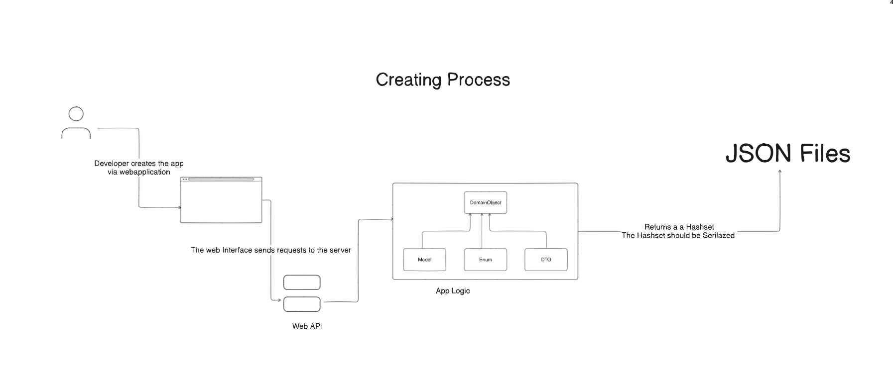
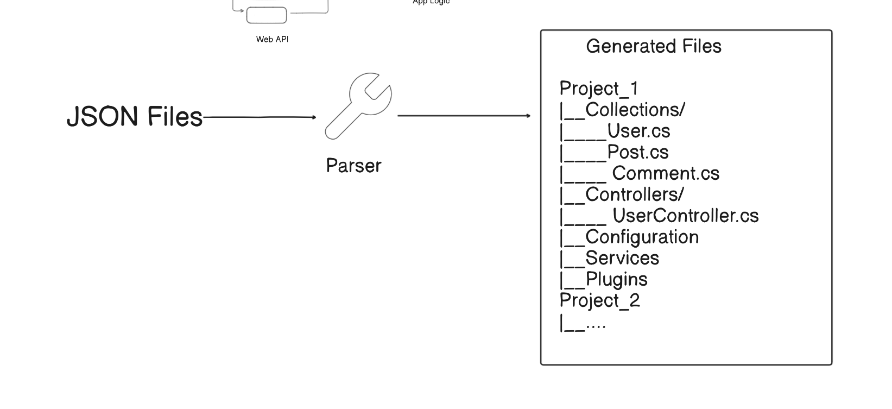

# The Libririan

So, you want to sail the world of apps — but you don’t have a guide or a map?
Maybe what you’re really searching for is a catalog.

But this isn’t just any catalog.
The Libririan is an extendable catalog — a living library where you can borrow, archive, or even trade in knowledge.

## What's it all about?

I’ve always loved the idea of Headless CMSs that can generate a Web API with almost no code. But extending the system itself can get tricky. Many tools store the structure of created collections in a database or a file, so whenever I want to extend a repository class, I have to fetch the model from wherever it’s stored and figure out the types. It works, but it can be tedious and hard to maintain. On top of that, every major release of the CMS brings its own challenges, and because types are loaded at runtime, there’s no way for Intellisense to know what type a model has.

That’s why I decided to build a tool that works differently. It lets the user create the bare minimum for their application. And when they want to extend it, they can export the collections and their logic into code files and continue from there. No guessing, no hidden structures—just clean, maintainable code.
And to make it feel more devloper friendly. The tool should also take care of setting up and configuring other tool that the app needs. Like dockerizing the App, Setting up the database server if it doesn't exist

## Who should use it

- Every developer that doesn't like to setup a project
- Every developer that **knows** how to create a backend and wants to a project very quickly
- Me... Why not.. I am also a developer and this project is to be considerd as my own "baby"

## Some Naming conventions (Didn't name my classes like this, but I am planning to do that)

- The Library $\equiv$ The code of my frontend
- The bookshelf $\equiv$ The Application that contains the whole logic
- The Collection $\equiv$ Model Classes, Entity Classes... whatever
- Books $\equiv$ A filed that is stored in the collection
- Category $\equiv$ Generated Enums

## Usecases

### For now

- The Developer should be able to automatically establish a database connection and setup the database only for the case that the db does not exist
- The app should allow the user to create the bare minimum for the application logic (check the link for details) [#1](https://github.com/Abdulrahman-AL-Sabagh/libririan/issues/1)
- The Application should manage Authentication and Authorization and help the user to configure Auth to 3rd party Services like Google, Github, Steam etc.
- The App should be able to fetch data from an API, Select the fields the Developer wants to deal with and save the fields and the data in the database
- The application should be able to provide the developer with an Email server

### For Future (Maybe)

- Graphql support
- Websockets Support
- GRPC Support
- MCP Support

## System Design

### Creating an App

### Exporting the App

## Technologies

### The Tool

Since this projects is helping me to improve my developer skills. I decided to build it with C#, becuase I am more used to OOP style and C#. But since I am writing a parser and a serializer... The tool doesn't really matter that much.
I can take the generated JSON files and write the parser in any other language like Kotlin, Java, GO and even C (though writing it in C would be… painful).

### Frontend

I decided to use Lit, becuase:

1. It is a very minimal library
2. I like it

Yes, there are some cases where I have to reinvent the wheel — like coding client-side routing — but I’m totally fine with that.
